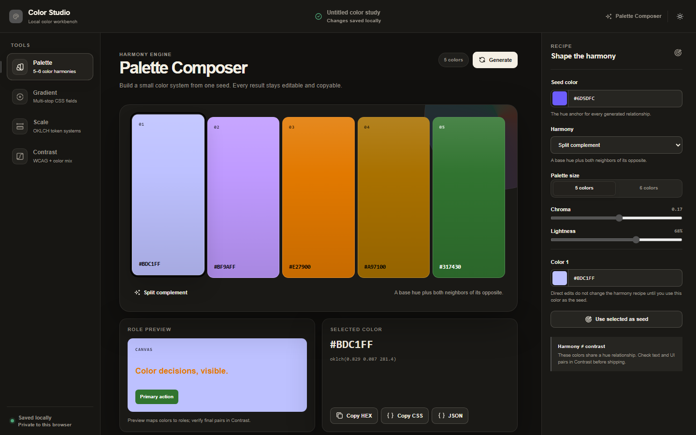
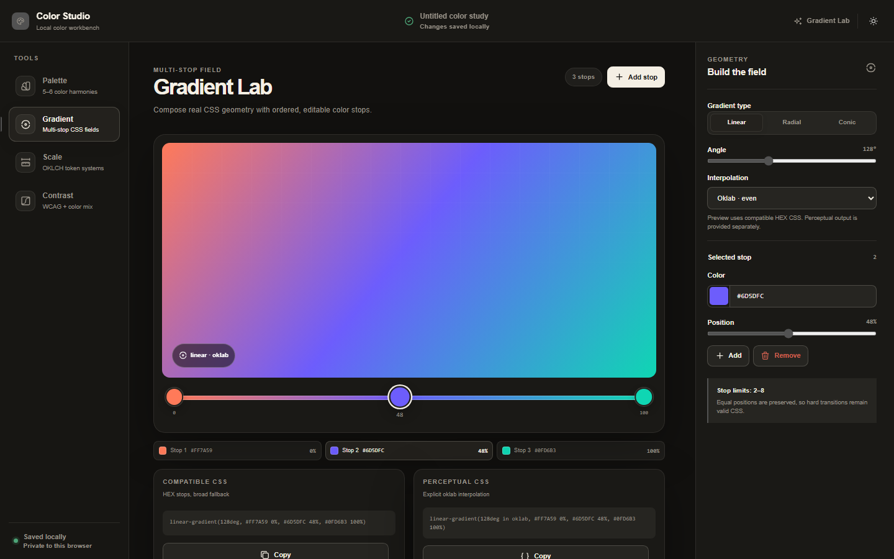
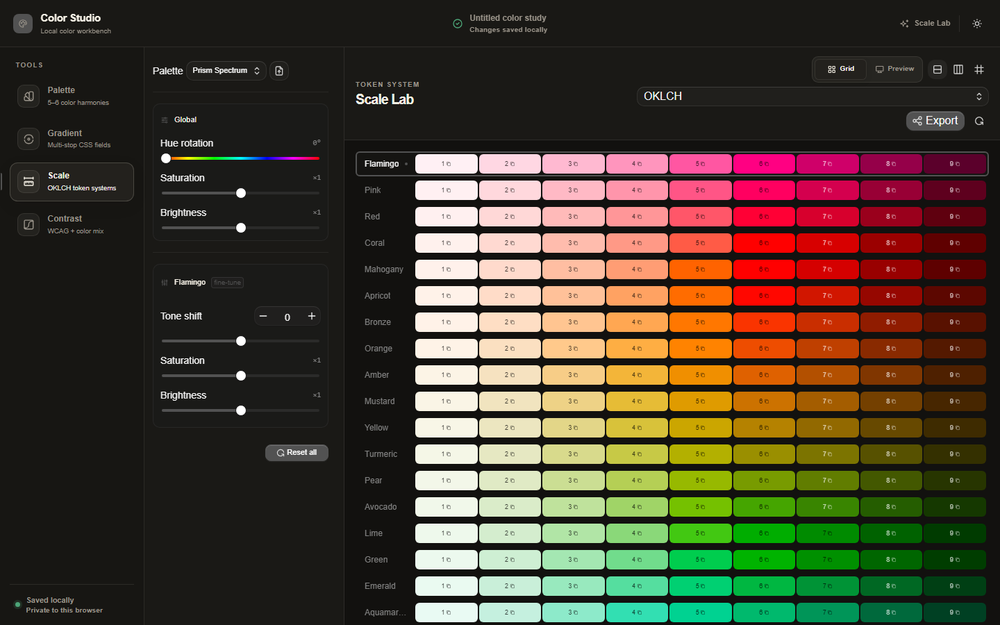
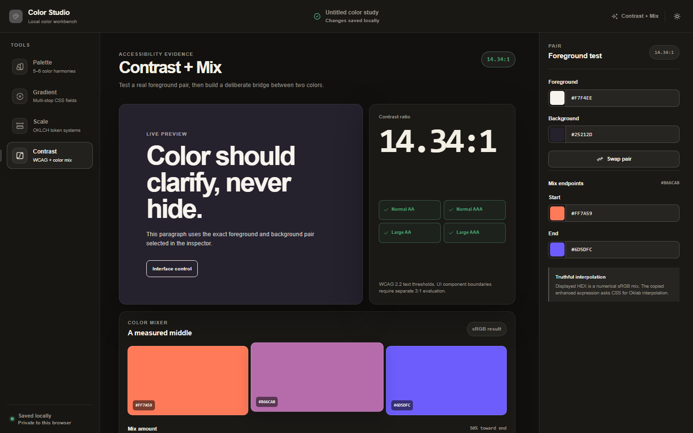

<p align="center">
  <picture>
    <source media="(prefers-color-scheme: dark)" srcset="https://shieldcn.dev/header/grid.svg?title=Color+Studio&subtitle=Build+palettes,+gradients,+OKLCH+scales,+and+accessible+color+pairs&logo=react&theme=orange&align=center&mode=dark" />
    
  </picture>
</p>

<p align="center">
  <a href="https://github.com/gvastethecreator/color-studio/actions/workflows/ci.yml"></a>
  <a href="https://github.com/gvastethecreator/color-studio/stargazers"></a>
  <a href="https://github.com/gvastethecreator/color-studio/commits/main"></a>
  <a href="https://gvastethecreator.github.io/color-studio/"></a>
  <a href="LICENSE"></a>
</p>

<p align="center">
  A local-first workbench for color systems, CSS gradients, accessibility checks, and production-ready exports.
  <br />
  <a href="https://gvastethecreator.github.io/color-studio/"><strong>Open the live app</strong></a>
</p>

## Product tour

| Palette Composer | Gradient Lab |
| --- | --- |
|  |  |
| **Scale Lab** | **Contrast + Mix** |
|  |  |

## What it does

- Builds editable five- or six-color harmonies from a seed color.
- Creates linear, radial, and conic gradients with ordered stops and perceptual interpolation.
- Tunes OKLCH token scales, imports custom presets, and previews component roles.
- Checks WCAG contrast and mixes exact color endpoints.
- Copies or downloads CSS variables, Tailwind 4 theme tokens, and JSON.
- Keeps project data in the browser. The app has no backend and sends no palette data to a remote service.

## Quick start

Install Node.js 20.19 or newer and pnpm 11.20.0.

```sh
pnpm install --frozen-lockfile
pnpm run dev
```

Open `http://127.0.0.1:3000`.

## Commands

| Command | Purpose |
| --- | --- |
| `pnpm run dev` | Start the development server. |
| `pnpm run check` | Check formatting, lint, and types. |
| `pnpm run test` | Run behavior tests with coverage. |
| `pnpm run build` | Build the production app. |
| `pnpm run preview` | Preview the production build. |
| `pnpm run clean` | Remove generated build and coverage output. |

VS Code exposes the same common commands in `.vscode/tasks.json`.

## Documentation

- [Documentation index](docs/README.md)
- [Architecture](docs/architecture.md)
- [Dependencies and upgrade notes](docs/dependencies.md)
- [Maintenance reviews](docs/reviews/README.md)
- [Technical debt](docs/TECHNICAL_DEBT.md)

## Status

- pnpm is the only supported package manager.
- GitHub Pages deploys the production build from `main`.
- The project is available under the [MIT License](LICENSE).

## Support

<p align="center">
  <a href="https://github.com/sponsors/gvastethecreator"></a>
</p>

Support continued development through [GitHub Sponsors](https://github.com/sponsors/gvastethecreator) or [Ko-fi](https://ko-fi.com/gvaste).
