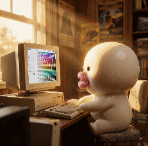

# Color Studio 

> 


[](https://bun.sh)
[](https://www.typescriptlang.org)
[](https://vitejs.dev)
[](https://react.dev)
[](LICENSE)

*Generate, fine-tune, and export OKLCH color scales with a live dashboard preview.*


🟥 **Generate** perceptually uniform color scales using built-in presets.

🟧 **Shift** hue, scale chroma, and scale lightness globally or per-family.

🟨 **Visualize** active color family on a variety of components.

🟩 **Import** custom preset collections from JSON and save settings.

🟦 **Cycle** application theme's accent color dynamically to preview UI using different palettes.

🟪 **View** swatches in multiple layouts.

🟫 **Export** generated color scales to CSS Custom Properties, Tailwind 4 `@theme` syntax, or raw JSON.

## Getting Started

Make sure you have [Bun](https://bun.sh) installed.

```bash
# Install dependencies
bun install
# Run the development server
bun run dev
```


> The dev server will run on `http://localhost:3000`.
---

- For deep technical details, check the [docs](docs/README.md) folder.
- For feature requests and suggestions, create an issue or submit a PR.
- If you like this project, consider giving it a star.
---

<h4 align="right">Support further development of this tool</h4>
<p align="right">
  <a href="https://github.com/sponsors/gvastethecreator/"></a>
  <a href="https://x.com/gvastebb"></a>
  
</p>
